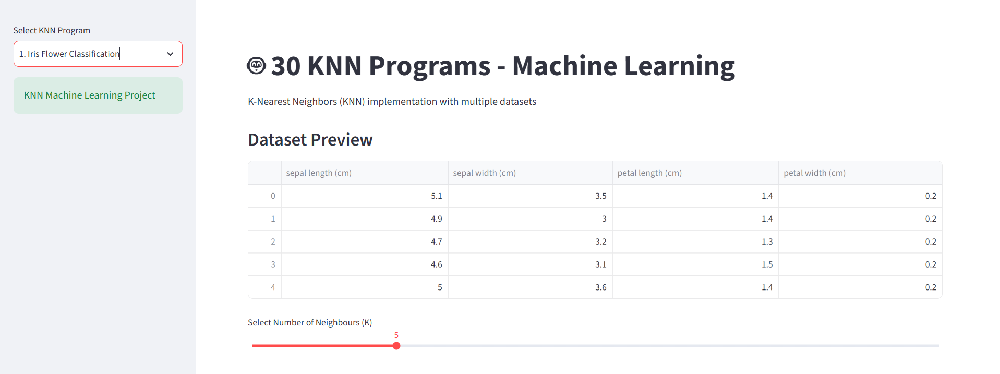

# 🤖 30 KNN Machine Learning Programs

## 📌 Project Description

The **30 KNN Machine Learning Programs** project demonstrates the implementation of the **K-Nearest Neighbors (KNN)** algorithm for solving machine learning classification problems.

This project includes data preprocessing, feature scaling, model training, evaluation, and deployment using a **Streamlit interactive dashboard**.

Users can adjust the value of **K (Number of Neighbors)** and generate predictions through an easy-to-use web interface.

---

## 🚀 Live Application

🔗 **Streamlit Deployment:**  
https://30-knn-machine-learning-programs-aspu4c8yayjkbyubbfewi3.streamlit.app/

---

## 🎯 Project Objectives

- Understand the working principle of K-Nearest Neighbors algorithm
- Perform data preprocessing and feature scaling
- Train and evaluate a KNN classification model
- Save and reuse trained ML models
- Deploy a machine learning application using Streamlit

---

## 🧠 Machine Learning Algorithm

### K-Nearest Neighbors (KNN)

KNN is a supervised machine learning algorithm that classifies data points based on the similarity of nearby data points.

It is commonly used for:
- Classification
- Pattern Recognition
- Recommendation Systems
- Prediction Tasks

---

## 🛠️ Technologies Used

- **Programming Language:** Python
- **Machine Learning:** Scikit-learn
- **Data Processing:** Pandas, NumPy
- **Model Deployment:** Streamlit
- **Model Serialization:** Pickle

---

## 📂 Project Structure


30-KNN-Machine-Learning-Programs
│
├── app.py
├── train_model.py
├── dataset.csv
├── model.pkl
├── requirements.txt
├── README.md
└── dashboard.png


---

## ⚙️ Project Workflow


Dataset Collection
↓
Data Preprocessing
↓
Feature Selection
↓
Feature Scaling
↓
Train-Test Split
↓
KNN Model Training
↓
Model Evaluation
↓
Model Deployment using Streamlit
↓
User Prediction


---

## 📊 Application Features

✅ Upload and process machine learning dataset  
✅ Perform feature scaling automatically  
✅ Train KNN model  
✅ Select number of neighbors (K value)  
✅ Evaluate model performance  
✅ Generate predictions using user inputs  
✅ Interactive Streamlit dashboard  

---

## 📸 Dashboard Preview



---

## 💻 Installation & Setup

### 1. Clone Repository

```bash
git clone <repository-url>
2. Navigate to Project Folder
cd 30-KNN-Machine-Learning-Programs
3. Install Required Libraries
pip install -r requirements.txt
▶️ Run the Project
Step 1: Train the Model
python train_model.py

This will generate:

model.pkl
Step 2: Launch Streamlit Application
streamlit run app.py

The application will open in your browser.

📈 Model Evaluation

The model performance is evaluated using:

Accuracy Score
Classification Report
📚 Skills Demonstrated
Python Programming
Machine Learning Model Development
Data Preprocessing
Feature Engineering
Model Training
Model Deployment
Streamlit Application Development
🔮 Future Enhancements
Add all 30 individual KNN use cases
Add multiple datasets
Add model comparison with other algorithms
Add interactive visualizations
Add automated ML pipeline
👩‍💻 Author

Sushma Rakesh

GitHub:
https://github.com/sushmarakesh17
